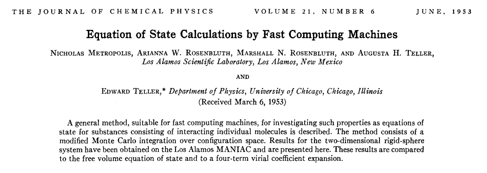
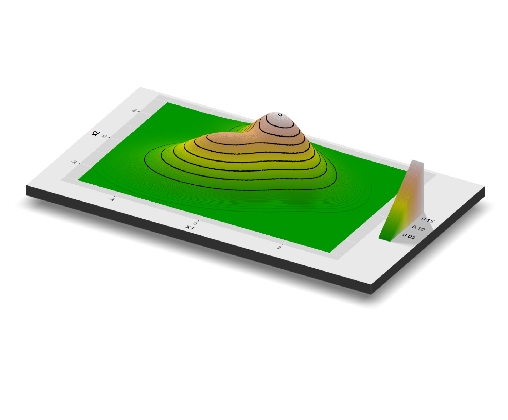
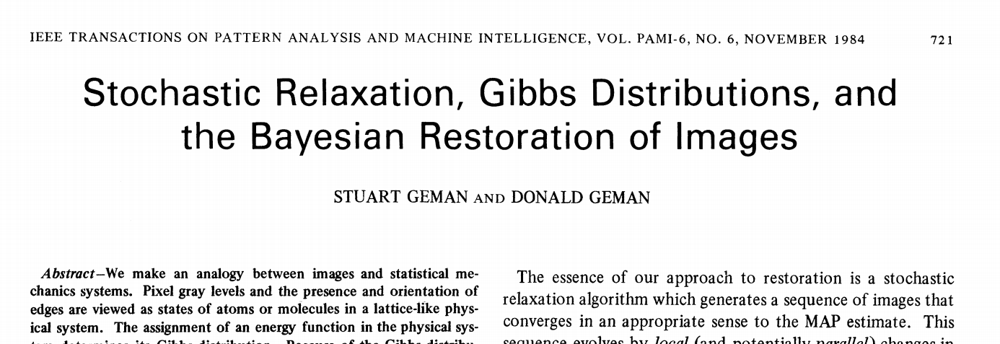

<style>
slides > slide.backdrop {
  background: white;
}
</style>

```{r setup, echo=FALSE,warning=FALSE,message=FALSE}
library(knitr)
opts_chunk$set(echo = FALSE,warning=FALSE,message=FALSE)
read_chunk('code/code1.R')
```

```{r loadLibraries}
```


## Goal in any Bayesian Analysis

- Let $X$ be some $K$ dimensional array of random variables 

- In Bayesian Learning we ultimately seek the joint distribution of $X$

$$
\pi(X)
$$

- From this we can derive other quantities of interest, e.g.,
$$
\begin{aligned}
{\rm E}[X] & \equiv \int X \;\pi(X)\; dX \\
{\rm Pr}(X < c) & = F(c) \equiv \int_{-\infty}^c \pi(X) dX, \\
q & =  F^{-1}(p)
\end{aligned}
$$
- These calculations can only be done analytically for the simplest models

## Simulation 

<div class="columns-2">
- One way to learn about a distribution is to analyze random draws from it!

```{r, echo=TRUE}
## learning about a gaussian

library(tidyverse)

mu <- 1.0
sigma <- 0.5
nSim <- 10000
df <- data.frame(x = rnorm(n = nSim, 
                           mean = mu,
                           sd = sigma))

e_x <- mean(df$x)
q_x <- quantile(df$x,probs=0.25)

pl <- df %>% 
  ggplot(aes(x = x)) + geom_density() 
```

```{r, fig.height=3,fig.width=3}
pl
```

- Simulated mean = `r prettyNum(e_x, digits=5)` (correct answer = 1)
- Simulated 25% quantile = `r prettyNum(q_x, digits=3)` (correct answer = `r prettyNum(qnorm(0.25, mean = 1, sd = 0.5), digits=3)`)


</div>

## Easy to Sample From Distributions

- Normal and multivariate normal distribution

- t distribution (and Cauchy distribution) 

- Gamma distribution (including exponential and chi-square distribution)

- F distribution

- Beta and Dirichlet distribution

- Poisson distribution 

- Binomial distribution 

- Negative Binomial distribution (and geometric distribution)

- Multinomial distribution

## Simulation from Any Distribution

- Can we get direct independent draws from any probability distribution $\pi(X)$? 

- No! Most joint posterior distributions derived from a Bayesian model do not have a known form that we can sample from directly  

- Rather than sample directly from posteriors, we will use algorithms that will generate a stream of pseudo-random numbers which will converge to draws from the target distribution (the posterior)

- Specifically, almost all algorithms used in Bayesian computation are based on sampling from a carefully constructed continuous state Markov chain. "Carefully" constructed here means constructed so that the stationary distribution of the Markov chain is the posterior distribution from our Bayesian model. These are Markov Chain Monte Carlo (MCMC) algorithms

- So we give up on getting direct independent draws from $\pi(X)$ - instead we will look for ways of generating a sequence of dependent draws $\lbrace \tilde X_s \rbrace_{s=1}^S$ which converges to draws from $\pi(X)$ as $S$ gets large 

- To understand how this works we first need a basic understand of Markov chains

## Continous State Markov Chains

- We will use Discrete Time Continuous State Markov Chains 

- The sequence $X_1,X_2,\dots$ is a Markov chain if the distribution of $X_t$ conditional $X_1,\dots,X_{t-1}$ only depends on $X_{t-1}$:

$$
p(X_t | X_{t-1},\dots,X_1) = p(X_t | X_{t-1})
$$

- The distribution on the right hand side is call the transition distribution 

- Assuming we can easily sample from the transition distribution, then we can generate a realization of the Markov chain as 
    - Start with a fixed $X_0$
    - Then sample $X_1$ as $X_1|X_0 \sim p(X_1|X_0)$
    - Sample $X_2$ as $X_2|X_1 \sim  p(X_2|X_1)$
    - Sample $X_3$ as...
    
## Example 

```{r exampleMC}
```

<div class="columns-2">

$$
\begin{aligned}
X_t & = \rho X_{t-1} + \varepsilon_{t}, \qquad |\rho| < 1 \\
\varepsilon_{t}| \sigma & \sim {\rm N}(0,\sigma^2)
\end{aligned}
$$

```{r, fig.width=5,fig.height=3}
all.pl
```

```{r, echo=TRUE,eval=FALSE}
rho <- 0.75
sigma <- 1.0 

nSim <- 5000
eps <- rnorm(nSim, mean = 0, sd = sigma)

# initialize array and set beginning
df <- data.frame(x = array(0,nSim))
df$step <- 1

df$x[1] <- 2.5

for (t in 2:nSim){
  df$x[t] = rho*df$x[t-1] + eps[t]
  df$step[t] <- t
}
```

</div>

## Stationary distribution 

- The stationary distribution $\pi$ of a Markov Chain with transition density $p(X|Z)$ is 
$$
\pi(X) = \int p(X|Z) \pi(Z) dZ
$$
- Think of this as the point where the distribution underlying the Markov chain in no longer evolving - it has converged to a stationary distribution

- "Well behaved" Markov chains always converge to their stationary distribution. "Well behaved" has a specific mathematical definition. We will not go into these details here (see Chapter 11 of the Bayesian Data Analysis text book)

- In Bayesian computation we construct the transition distribution $p(X|Z)$ such that 
    1. We can easily sample from $p(X|Z)$ and
    2. The implied stationary distribution $\pi(X)$ is the posterior distribution for the Bayesian model


## Example 

- The stationary distribution for the example above is
$$
\pi(X) = {\rm N}\Big(0,\frac{\sigma^2}{1- \rho^2} \Big)
$$
- Check: The transition distribution $p(X|Z)$ is 
$$
X = \rho Z + \varepsilon,
$$
where $\varepsilon \sim {\rm N}(0,\sigma^2)$. We need to show that if $Z \sim \pi(Z)$ then $X \sim \pi(X)$.

- To show this we can use the fact that a linear function of a normal distribution is another normal distribution with mean ${\rm E}[\rho Z + \varepsilon]=0$ and variance 
$$
{\rm V}[\rho Z + \varepsilon] = \rho^2 {\rm V}[Z] + {\rm V}[\epsilon] = \rho^2 \frac{\sigma^2}{1- \rho^2} + \sigma^2 = \frac{\sigma^2}{1- \rho^2}
$$

## {.flexbox .vcenter}

<div class="centered">
<font size="22">Markov Chain Monte Carlo Algorithms</font>
</div>


## Metropolis Algorithm 

{#id .class width=85% height=25%}

## 

<p align="center">
{#id .class width=40% height=70%}
</p>

<p align="center">
Arianna W. Rosenbluth, September 15, 1927 - December 28, 2020
</p>


## Metropolis Algorithm 

- Let $\pi(X)$ be the target distribution we want to sample from and let $p(X^*|X)$ be a symmetric proposal distribution generating a proposed move $X^*$ of the chain, conditional on the current state $X$ (symmetric means $p(X^*|X) = p(X|X^*)$)

- The algorithm starts with a starting value $X_0$ and then generates $\lbrace X_t \rbrace_{t=1}^T$ as follows:

1. Conditional on the current state $X_{t-1}$, generate a proposed move $X^*$ from the proposal distribution:
$$
X^* \sim p(X^*|X_{t-1})
$$
2. Calculate 
$$
r = \min \Bigg \lbrace \frac{ \pi(X^*) }{ \pi(X_{t-1}) }, 1 \Bigg \rbrace
$$
3. Update the new state $X_{t}$ as 
$$
X_t = \begin{cases}
X^* & \text{with probability $r$}, \\
X_{t-1} & \text{with probability $1-r$}
\end{cases}
$$


## Example

```{r exampleMetropolis}
```


<div class="columns-2">

- Suppose we had to sample from a mixture of two bivariate normal distributions

- For $x = (x_1,x_2)$, the target density is 

$$
p(x) = \lambda \; {\rm N}(x|\mu_1,\Sigma_1) + (1-\lambda) \; {\rm N}(x|\mu_2,\Sigma_2)
$$
where $\mu_1=(-0.5,0.0)$, $\mu_2=(0.25,1.5)$ and 
$$
\Sigma_1 = \begin{bmatrix}
0.75 & 0.25 \\ 0.25 & 0.75
\end{bmatrix}, ~~
\Sigma_2 = \begin{bmatrix}
0.5 & -0.25 \\ -0.25 & 0.5
\end{bmatrix}
$$
and $\lambda = 0.6$

- Note: There are ways of sampling from this distribution directly, but let's imagine we don't know how to!


```{r, fig.height=4,fig.width=4}
ggpl
```

## 3D plot of target

<p align="center">
{#id .class width=90% height=70%}
</p>


</div>

## Picking a Proposal Distribution

- The key ingredient in the Metropolis algorithm is picking the proposal distribution

- The proposal distribution should 
    1. Be symmetric and
    2. Be easy to sample from and
    3. Generate draws that resemble the target distribution 

- One class of proposal distributions that often work well is the random walk proposal: 
$$
X^* = X_{t-1} + \alpha \; \varepsilon 
$$
where $\alpha > 0$ is a "jump" rate and usually $\epsilon \sim {\rm N}(0,I)$.

- $\alpha$ is chosen by experimentation to get a good compromise between a high acceptance rate and fast convergence to target distribution
    - If $\alpha$ is too big, most proposals will be rejected. If $\alpha$ is too small, the chain moves too slowly

## Simulation Result 

```{r sampleExampleMetropolis2}
```

<div class="columns-2">
```{r, echo=TRUE, eval=FALSE}
alpha <- 1.0

nSim <- 10000
chain <- array(0,c(nSim,2))
acceptCount <- 0

for (i in 2:nSim){
  ## propose new move 
  e <- rnorm(2, sd = alpha)
  x_star <- chain[i-1,] + e
  
  ## calculate accept rate 
  dCurrent <- target(chain[i-1,])
  dNew <- target(x_star)
  
  r <- dNew/dCurrent

  if (runif(1) < r){
    chain[i,] <- x_star
    acceptCount <- acceptCount + 1
  } else {
    chain[i,] <- chain[i-1,]
  }
}
```


```{r, fig.width=4.5,fig.height=4.5}
ggpl2
```

- Accept rate = `r prettyNum(acceptRate, digits=2)`

</div>

## Sanity Check

- The target distribution has mean and covariance matrix 
$$
\begin{aligned}
{\rm E}[X] & = (-0.2,0.6), \\
{\rm V}[X] & = 
\begin{bmatrix}
0.79 & 0.32 \\ 
0.32 & 1.19
\end{bmatrix}
\end{aligned}
$$
- If our samples are from the correct distribution - and we have enough of them - then we should be able to get close to these values by simply looking at the sample average and covariance of the sampled values: 

```{r}
burnIn <- 5000

colMeans(chainDF[burnIn:nSim,])

cov(chainDF[burnIn:nSim,])
```


## Metropolis Example: Logit Classifier

- Suppose we have classes $Y \in \lbrace 0,1\rbrace$ and features $X$ and we assume 
$$
{\rm Pr}(Y=1|X,\beta) = \frac{\exp\lbrace \beta'X \rbrace}{1 + \exp\lbrace \beta'X \rbrace}
$$
- Normally we train this model by maximizing the log-likelihood function: 
$$
\log L(\beta) = \sum_{i=1}^N Y_i \log {\rm Pr}(Y_i=1|X_i,\beta) + (1-Y_i)\log \big( 1 -{\rm Pr}(Y_i=1|X_i,\beta)\big)
$$

- If we specify a prior $\pi(\beta)$, then the log-posterior is 
$$
\log p(\beta) = \log L(\beta) + \log \pi(\beta)
$$

- Let's try to train this model using the Metropolis algorithm with a random walk proposal distribution

## Synthetic Data

- Generate 1,000 observations with 
$$
X_i = (1,\, x_{i2},\, x_{i3},\, x_{i4},\, x_{i5}), 
$$
and $x_{ij} \sim {\rm N}(0,1)$

- The true $\beta$ is 
$$
\beta = (0.0,0.5,1.0,-0.5,0.0)
$$

- We use a prior 
$$
\beta \sim {\rm N}(0,\tau^{-1} I_5)
$$

## Result 

```{r plotLogitMetropolis, fig.width=9,fig.height=5}
```

## Metropolis-Hastings 

- This is a generalization of the Metropolis algorithm that allows for non-symmetric proposal distributions 

- All we need is to correct the acceptance probability by including the proposal:
$$
r = \min \Bigg \lbrace \frac{ \pi(X^*) / p(X^*|X_{t-1}) }{ \pi(X_{t-1})/ p(X_{t-1}|X^*) }, 1 \Bigg \rbrace
$$

- Other than that everything else is the same 

## Problem with Metropolis

- The Metropolis (and Metropolis-Hastings) algorithm is a great general purpose algorithm 

- There is one downside: In large dimensions it often runs into a big problem: Almost all proposals get rejected!

- The bigger the dimension of $X$ is, the more likely it is that some elements of $X$ are outside of the mass of $\pi(X)$ and therefore the entire $X$ gets rejected 

- This happens since the advantage of the Metropolis algorithm is also a disadvantage: The proposal distribution doesn't use any information about $\pi(X)$

- Thankfully, there is another general algorithm that we can rely on in large dimensions 

## Gibbs Sampling 

{#id .class width=85% height=25%}

## Gibbs Sampling 

- The Gibbs sampler is based on a very basic observation: All information in a joint distribution $p(X_1,X_2)$ is contained in the two conditional distributions $p(X_1|X_2)$ and $p(X_2|X_1)$ (subject to some very mild assumptions)

- The Gibbs sampler is based on constructing a Markov chain where the transition distribution is made up of each of the conditional distributions:

- Start with $X_{2,0}$. Then sample $\lbrace X_{1t},X_{2t} \rbrace_{t=1}^T$ as 
$$
\begin{aligned}
X_{1t}|X_{2t-1} & \sim p(X_{1t}|X_{2t-1}), \\
X_{2t}|X_{1t} & \sim p(X_{2t}|X_{1t}), \\
\end{aligned}
$$
- Basic advantage: It is easier to sample from a series of conditional distributions than directly from the joint distribution

## Gibbs Sampling 

- You can run the Gibbs sampler on any number of partitions of the full variable $X$

- For example, dividing $X$ into three arrays $X = (X_1,X_2,X_3)$, the Gibbs sampler is 
$$
\begin{aligned}
X_{1t}|X_{2t-1},X_{3t-1} & \sim p(X_{1t}|X_{2t-1},X_{3t-1}), \\
X_{2t}|X_{1t},X_{3t-1} & \sim p(X_{2t}|X_{1t},X_{3t-1}), \\
X_{3t}|X_{1t},X_{2t} & \sim p(X_{3t}|X_{1t},X_{2t})
\end{aligned}
$$

- Now - let's look at some examples of how to derive the required conditional distributions

## Example 1

- Consider the simple normal distribution model: 
$$
X_i|\mu,\tau \sim {\rm N}(\mu,\tau^{-1}), \qquad i=1,\dots,N
$$
where we use a normal prior for $\mu$ and a gamma distribution for $\tau$ (the precision = 1/variance):
$$
\begin{aligned}
\mu & \sim {\rm N}(\mu_0,\tau_0^{-1}), \\
\tau & \sim {\rm G}(a_0,b_0)
\end{aligned}
$$
- We need to find the conditional distributions $p(\mu|\tau,X)$ and $p(\tau|\mu,X)$

- Note that we have already derived $p(\mu|\tau,X)$ - we did this in week 1, example III (see slide 29):
$$
p(\mu|\tau,X) = {\rm N}(m,c^{-1}),~~~ c \equiv \tau N + \tau_0,~~  m \equiv  \frac{\tau \sum_i X_i + \tau_0 \mu_0 }{c}
$$

## Gamma Distribution 


- The [Gamma distribution](https://en.wikipedia.org/wiki/Gamma_distribution) is a distribution on the positive real axis:
$$
{\rm G}(\tau|a_0,b_0) = \frac{{b_0}^{a_0}}{\Gamma(a_0)} \tau^{a_0-1} \exp(-b_0 \tau),
$$
with the properties 
$$
\begin{aligned}
{\rm E}[\tau] & = \frac{a_0}{b_0},  \\
{\rm V}[\tau] & = \frac{a_0}{b^2_0}  
\end{aligned}
$$
- This allows us to express a wide range of beliefs about $\tau$


## 

- Next we need the other conditional $p(\tau|\mu,X)$

- Again from Week 1, slide 29 we have the likelihood function 
$$
p(X_1,\dots,X_N|\mu,\tau) = \Big(\frac{1}{\sqrt{2\pi}}\Big)^N \tau^{N/2} \exp\Big( -\frac{\tau}{2} ssq\Big)
$$

$ssq = \sum_{i=1}^N (X_i - \mu)^2$

- Therefore the conditional for $\tau$ is 
$$
\begin{aligned}
p(\tau|\mu,X) & = p(X_1,\dots,X_N|\mu,\tau) \times {\rm G}(\tau|a_0,b_0) \\
 & = C \times \tau^{N/2} \exp\Big( -\frac{\tau}{2} ssq\Big) \times \tau^{a_0-1} \exp(-b_0 \tau) \\
 & = C \times \tau^{a_0 + N/2 - 1} \exp\Big\lbrace -\tau (b_0 + \tfrac{1}{2} ssq )   \Big \rbrace
\end{aligned}
$$
- We recognize this as another as another Gamma distribution: ${\rm G}(a_0 + N/2, b_0 + \tfrac{1}{2}ssq)$

## Gibbs Sampler 

- We have derived our first Gibbs sampler which simply means repeatedly sampling from 
    1. $\mu_t|\tau_{t-1} \sim {\rm N}\big(m(\tau_{t-1}),c(\tau_{t-1})^{-1}\big)$
    2. $\tau_t|\mu_t \sim {\rm G}\big( a_0 + N/2, b_0 + \tfrac{1}{2} ssq(\mu_t)  \big)$

- This requires that we are able to sample from a Normal and Gamma distribution but that is easy      

```{r, eval=FALSE,echo=TRUE}
for (i in 2:nIter){
  ## mu|tau
  mu_var <- 1.0/(gibbsDF$tau[i-1]*N + tau0)
  mu_mean <- mu_var*(gibbsDF$tau[i-1]*sum_x + tau0*mu0)
  gibbsDF$mu[i] <- rnorm(1,mean = mu_mean, sd = sqrt(mu_var))
  
  ## tau|mu
  ag <- a0 + 0.5*N
  bg <- b0 + 0.5*sum((df$X - gibbsDF$mu[i])^2)
  gibbsDF$tau[i] <- rgamma(1,shape = ag, rate = bg)
}
```

## Result 

```{r runGibbs1}
```

```{r resultsGibbs1}
```


<div class="columns-2">

```{r, fig.width=4.5,fig.height=3}
mcmcPlot
```

```{r}
gibbsStat
```


```{r, fig.width=4.5,fig.height=4}
postPlot
```


</div>


## Example 2: Uber Revisited 

$$
y_{ij}|\alpha_i,\sigma \sim {\rm N}(\alpha_i,\tau^{-1}), \qquad j=1,\dots,N_i;i=1,\dots,N, 
$$
with priors
$$
\begin{aligned}
\alpha_i|\mu,\sigma_\alpha & \sim {\rm N}(\mu_\alpha,\tau^{-1}_\alpha), \\
\mu_\alpha & \sim {\rm N}(\mu_0,\tau_0^{-1}), \\
\tau & \sim {\rm G}(a_0,b_0),  \\
\tau_\alpha & \sim {\rm G}(c_0,d_0), 
\end{aligned}
$$

## Conditional Distributions 

- We already know how to get the conditional for $\alpha_i$ and $\mu_\alpha$ - this is exactly as above: 
$$
\alpha_i|Y,\mu_\alpha,\tau_\alpha,\tau \sim {\rm N}(m_i,c_i^{-1}), 
$$
where $c_i = \tau N_i  + \tau_\alpha$ and $m_i = c_i^{-1} ( \tau \sum_{j=1}^{N_i} X_{ij} + \tau_\alpha \mu_\alpha  )$


## 

- For $\mu_\alpha$ this gives us 

$$
\mu_\alpha | \alpha,\tau_\alpha \sim {\rm N}(m,c^{-1})
$$
where $c = \tau_\alpha N + \tau_0$ and $m = c^{-1} ( \tau_\alpha \sum_{i=1}^N \alpha_i  + \mu_0 \tau_0)$

- For $\tau_\alpha$ we can again follow the derivation in Example 1 to get 
$$
\tau_\alpha|\alpha,\mu_\alpha \sim {\rm G}\big( c_0 + \tfrac{1}{2} N, d_0 + \tfrac{1}{2} \sum_{i=1}^N (\alpha_i - \mu_\alpha)^2 \big)
$$
- Finally for $\tau$ we can follow a similar derivation across $i$ and $j$ to get 
$$
\tau|\alpha,Y \sim {\rm G}\big( a_0 + \tfrac{1}{2} \sum_{i=1}^N N_i, b_0 + \tfrac{1}{2} \sum_{i=1}^N \sum_{j=1}^{N_i} (Y_{ij} - \alpha_i)^2 \big)
$$

## Code

```{r, echo=TRUE, eval=FALSE}
for (i in 2:nIter){
  ## alpha
  mu_var <- 1.0/(gibbs1$tau[i-1]*dfStats$n_i + gibbs1$tau_alpha[i-1])
  mu_mean <- mu_var*(gibbs1$tau[i-1]*dfStats$sumY + 
                      gibbs1$tau_alpha[i-1]*gibbs1$mu_alpha[i-1])
  gibbs2[i,] <- mu_mean + sqrt(mu_var)*rnorm(nRiders)
  
  ## mu_alpha
  mu_var <- 1.0/(gibbs1$tau_alpha[i-1]*nRiders + tau0)
  mu_mean <- mu_var*(gibbs1$tau_alpha[i-1]*sum(gibbs2[i,]) + tau0*mu0)
  gibbs1$mu_alpha[i] <- rnorm(1,mean = mu_mean, sd = sqrt(mu_var))
  
  ## tau_alpha
  ag <- c0 + 0.5*nRiders
  bg <- d0 + 0.5*sum((gibbs2[i,] - gibbs1$mu_alpha[i])^2)
  gibbs1$tau_alpha[i] <- rgamma(1,shape = ag, rate = bg)
  
  ## tau
  ag <- c0 + 0.5*nTotal
  bg <- d0 + 0.5*( ssqAll + sum(dfStats$n_i*(gibbs2[i,]^2)) - 
                     2.0*sum(gibbs2[i,]*dfStats$sumY))
  gibbs1$tau[i] <- rgamma(1,shape = ag, rate = bg)
}

```


## 

```{r uberGibbs}
```

```{r uberGibbsPlots}
```

```{r, fig.height=4,fig.width=8}
tracePlotUber
```


## Comparison to Stan Run (Week 2)

- Gibbs Summary:

```{r}
gibbsStat
```

- Stan Summary:

```{r}
stanMCMCStat
```

## Comparison to Stan Run (Week 2)

```{r, fig.height=5,fig.width=5}
alphaCompPlot
```


## HMC and Stan

- HMC = Hybrid Monte Carlo

- This is a version of Metropolis-Hastings where we use information about the gradient of the log-posterior to propose promising moves 

- This often leads to algorithms with high acceptance rates and fast convergence 

- Can be implemented manually or by using Stan 

- Next module! 


